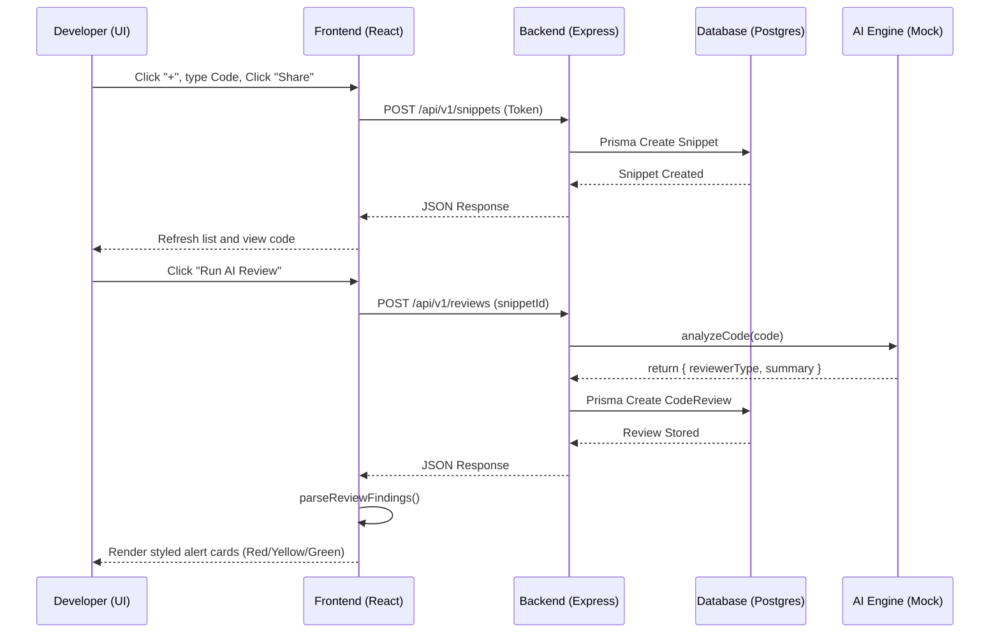

# CodeMesh Development Log: Snippet Sharing & AI Reviews Integration

This document outlines the detailed changes I implemented today in CodeMesh, the technical rationale behind my design choices, and explanations of my code modifications.

---

## 1. Objectives & Rationale

Prior to today's work, the CodeMesh prototype supported Authentication, Workspace Management, and Real-Time Chat channels. However, two crucial functional requirements from the MVP specification were missing in the user interface:
1. **Code Snippet Sharing**: Sharing script snippets in dedicated workspaces without polluting main chat channels.
2. **AI Code Review**: Submitting code snippets for instant automated audits.

### Why I made these changes
- **Backend listing gap**: The backend had snippet routes for CRUD (`POST`, `GET`, `PUT`, `DELETE` by ID), but lacked an endpoint to list all snippets shared within a workspace. I needed a `GET /api/v1/snippets?workspaceId=...` route.
- **Review associations**: The database model defined a one-to-many relation (`Snippet` -> `CodeReview`), but fetching snippet details did not load its past reviews. I updated the endpoint to include reviews in details payload.
- **Unified Workspace Experience**: Rather than introducing heavy routing libraries (like React Router) or separate pages, I extended the existing sub-navigation layout inside the main workspace component (`ChatArea`). This maintains standard workspace layouts (like Slack or Discord) and provides a fast toggle between **Chat** and **Snippets**.

### Product Design: Separation of Code Snippets from General Chat Channels

Mixing code sharing and reviews into general chat channels creates friction. I separated them due to the following structural and design considerations:

1. **Noise and Ephemerality in Chat**:
   - General channels are high-velocity streams designed for messages, announcements, and quick standup updates. 
   - Dumping large source code blocks (often hundreds of lines) into a chat stream pushes relevant conversation context off the screen, causing visual clutter and lowering communication efficiency.

2. **Dedicated Syntax, Line Numbers, and IDE Layout**:
   - Reading, discussing, and auditing code requires a specialised reading layout.
   - Normal chat bubbles are constrained in width and lack side-by-side splits or IDE features like line numbers. Separating snippets allows us to offer an isolated workspace displaying monospace fonts and syntax formatting.

3. **Structured Review Audits vs. Chat Thread Noise**:
   - An AI review generates formal static reports (Security risks, performance costs, and quality checklists).
   - If reviews were posted as standard channel messages, this structured audit history would get lost in active conversation threads. By separating snippets, I create a persistent audit trail linked directly to specific code versions.

4. **Action Hooks and State Mapping**:
   - The Snippet area has specific actions: "Request AI Review", "Select Language", "Search by code metadata". These custom buttons and states do not map cleanly onto general channel message inputs.

---

## 2. Detailed Code Explanations

### A. Backend - Snippet Routes
File: [snippets.js](file:///d:/Projects/CodeMesh/backend/src/routes/snippets.js)

#### 1. Listing Workspace Snippets (`GET /`)
I added a new endpoint that retrieves all snippets for a given workspace.
```javascript
router.get('/', async (req, res) => {
    const { workspaceId } = req.query;
    const userId = req.user.id;

    if (!workspaceId) {
        return res.status(400).json({ error: 'workspaceId query parameter is required' });
    }

    try {
        // Validation: Verify caller is a member of this workspace
        const member = await prisma.workspaceMember.findUnique({
            where: {
                workspaceId_userId: { workspaceId, userId }
            }
        });
        if (!member) {
            return res.status(403).json({ error: 'Access denied: You are not a member of this workspace' });
        }

        // Database Query
        const snippets = await prisma.snippet.findMany({
            where: { workspaceId },
            include: {
                author: {
                    select: { id: true, name: true, email: true, avatarUrl: true }
                }
            },
            orderBy: { createdAt: 'desc' }
        });
        res.json(snippets);
    } catch (error) {
        res.status(500).json({ error: error.message });
    }
});
```
- **Why**: Security check verifies workspace membership first using `prisma.workspaceMember` before running queries.
- **Includes**: The `author` relation is joined to display the creator's name on the sidebar list items.

#### 2. Detailed Snippet Retrieval with Reviews (`GET /:snippetId`)
I updated the existing snippet details fetcher to pull associated reviews.
```javascript
        const snippet = await prisma.snippet.findUnique({
            where: { id: snippetId },
            include: {
                author: {
                    select: { id: true, name: true, email: true, avatarUrl: true }
                },
                reviews: {
                    orderBy: { createdAt: 'desc' } // Fetch latest reviews first
                }
            }
        });
```
- **Why**: Bundles the code details and past review logs in a single request. This reduces API roundtrips when a developer clicks a snippet card.

---

### B. Frontend - Routing & Tab Setup
Files: [ChatArea.jsx](file:///d:/Projects/CodeMesh/frontend/src/ChatArea.jsx) & [ChatArea.css](file:///d:/Projects/CodeMesh/frontend/src/ChatArea.css)

I implemented an `activeTab` navigation toggle state (`'chat'` or `'snippets'`).

#### 1. Conditional Routing
Inside the render method of `ChatArea.jsx`, I intercept state before return:
```javascript
    if (activeTab === 'snippets') {
        return (
            <SnippetsArea
                workspace={workspace}
                currentUser={currentUser}
                onBackToWorkspaces={onBackToWorkspaces}
                members={members}
                activeTab={activeTab}
                setActiveTab={setActiveTab}
            />
        );
    }
```
- **Why**: If `'snippets'` is clicked, control is passed to `SnippetsArea`. Passing `activeTab` and `setActiveTab` lets `SnippetsArea` render the exact same sidebar header structure and allows switching back to chat.

#### 2. Navigation Styling
Buttons inside `.sidebar-tabs` use flex layouts and transitions for hover states:
```css
.tab-btn {
    flex: 1;
    background: none;
    border: 1px solid var(--border-color);
    color: var(--text-secondary);
    padding: 8px 12px;
    border-radius: var(--border-radius);
    cursor: pointer;
    font-size: 13px;
    font-weight: 500;
    transition: var(--transition);
}
.tab-btn.active {
    background-color: var(--bg-tertiary);
    border-color: var(--border-focus);
    color: var(--text-primary);
}
```

---

### C. Frontend - Code Snippets & Review Screen
Files: [SnippetsArea.jsx](file:///d:/Projects/CodeMesh/frontend/src/SnippetsArea.jsx) & [SnippetsArea.css](file:///d:/Projects/CodeMesh/frontend/src/SnippetsArea.css)

This is the primary modular screen I built today. It contains three layout columns:
1. **Left Sidebar Column**: Shared snippets list + filter query input + "Add" modal button.
2. **Center Column (Code Viewer)**: Displaying code content.
3. **Right Column (AI Review Panel)**: Triggering and viewing code reports.

#### Key Features in `SnippetsArea.jsx`

#### 1. Code Editor Layout with Line Numbers
I parse the snippet source code string and split it by newline (`\n`) to generate dynamic line numbers matching the height of code text lines:
```jsx
<div className="editor-container">
    <div className="line-numbers">
        {snippetDetails.code.split('\n').map((_, index) => (
            <div key={index} className="line-num">{index + 1}</div>
        ))}
    </div>
    <pre className="code-block">
        <code>{snippetDetails.code}</code>
    </pre>
</div>
```
Combined with CSS rules (e.g. JetBrains Mono font, fixed line-height matching `.line-num`, and custom selection colors), this builds an IDE-like interface.

#### 2. Parsing Review Log Strings into Colored Cards
The backend AI reviewer returns a flat string (`summary`). To give this a premium dashboard aesthetic, I wrote a client-side parser to read severity patterns and split them:
```javascript
const parseReviewFindings = (summary) => {
    if (!summary) return [];
    const lines = summary.split('\n');
    return lines.map((line, idx) => {
        if (line.includes('[SECURITY]')) {
            return { id: idx, type: 'security', label: 'Security Alert', text: line.replace('- [SECURITY]', '').trim() };
        }
        if (line.includes('[STYLE]')) {
            return { id: idx, type: 'style', label: 'Style Feedback', text: line.replace('- [STYLE]', '').trim() };
        }
        if (line.includes('[QUALITY]')) {
            return { id: idx, type: 'quality', label: 'Quality Insight', text: line.replace('- [QUALITY]', '').trim() };
        }
        return null;
    }).filter(Boolean);
};
```
Findings are rendered with separate CSS classes (`.finding-security`, `.finding-style`, `.finding-quality`), mapping to red, orange, or green highlights:
```css
.finding-security {
    background-color: rgba(239, 68, 68, 0.05);
    border-color: var(--accent-error); /* Red border line */
}
```

#### 3. Modal Form and Validation
The "Share Code Snippet" modal manages local forms. Textarea input fields use a custom class `.code-textarea` which sets standard monospace typography (`font-family: var(--font-mono)`), making it easy to format copy-pasted blocks.

---

## 3. How the Integrated Lifecycle Works



This updates my MVP workspace to offer fully functional, interactive developer environments!
