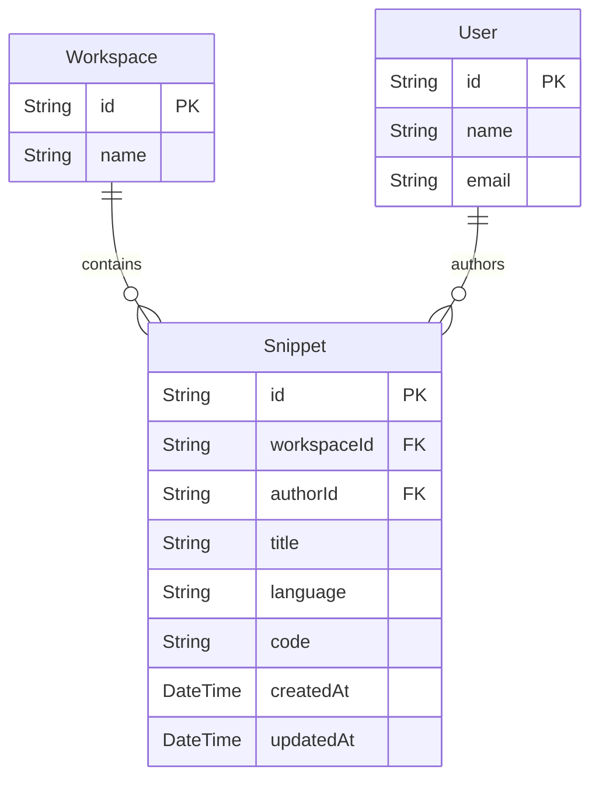

# CodeMesh Snippet Management Implementation Summary

This document describes my design, database models, API routes, security controls, and verification strategy implemented for the **Snippet Management System** in CodeMesh (Phase 5). It details my code updates, architectural decisions, and setup instructions.

---

## 1. Overview of the Snippet System

Snippets allow workspace members to share block of codes with titles and language identifiers. My system guarantees that:
1. **Workspace Association**: Every snippet is tied directly to a workspace and inherits membership rules.
2. **Access Security**: Users can only create or view snippets inside workspaces where they are active members.
3. **Role-Based Updates/Deletion**: Regular members can only modify or delete snippets that they authored, while workspace **Owners** and **Admins** can update or delete any snippet inside their workspace.
4. **Data Cascades**: Deleting a workspace or deleting a user automatically cascades to clean up all related snippets.

---

## 2. Updated Database Schema

My database models defined in [schema.prisma](file:///d:/Projects/CodeMesh/backend/prisma/schema.prisma) are updated as follows:



### Models Syntax Reference
```prisma
model Snippet {
  id          String   @id @default(uuid())
  workspaceId String   @map("workspace_id")
  authorId    String   @map("author_id")
  title       String
  language    String
  code        String
  createdAt   DateTime @default(now()) @map("created_at")
  updatedAt   DateTime @updatedAt @map("updated_at")
  
  workspace   Workspace @relation(fields: [workspaceId], references: [id], onDelete: Cascade)
  author      User      @relation(fields: [authorId], references: [id], onDelete: Cascade)

  @@map("snippets")
}
```

### Key DB Decisions
* **Relations**: Linked to both `Workspace` (group separation) and `User` (author tracking).
* **Cascading Delete (`onDelete: Cascade`)**: Deleting a workspace deletes all snippets shared in it. Deleting a user deletes all snippets they uploaded.

---

## 3. Registered API Endpoint Map

All routes require authentication (JWT) and are registered under the `/api/v1/snippets` prefix in [index.js](file:///d:/Projects/CodeMesh/backend/src/index.js):

| Route Method | Path Pattern | Description | Allowed Workspace Role / Scope |
| :--- | :--- | :--- | :--- |
| **POST** | `/` | Share/Create a new snippet | Workspace Member |
| **GET** | `/:snippetId` | Fetch snippet details by ID | Workspace Member |
| **PUT** | `/:snippetId` | Update snippet details | Snippet Author OR Workspace Owner/Admin |
| **DELETE** | `/:snippetId` | Delete a snippet | Snippet Author OR Workspace Owner/Admin |

---

## 4. Detailed Code Breakdown

All route controllers are implemented in [snippets.js](file:///d:/Projects/CodeMesh/backend/src/routes/snippets.js):

### 4.1 Create Snippet (`POST /`)
Verifies metadata is complete, and checks workspace membership of the creator:
```javascript
router.post('/', async (req, res) => {
    const { workspaceId, title, language, code } = req.body;
    const authorId = req.user.id;

    if (!workspaceId || !title || !language || !code) {
        return res.status(400).json({ error: 'workspaceId, title, language, and code are required' });
    }
    
    // Verify user is member of the workspace
    const member = await prisma.workspaceMember.findUnique({
        where: { workspaceId_userId: { workspaceId, userId: authorId } }
    });
    if (!member) {
        return res.status(403).json({ error: 'Access denied: You are not a member of this workspace' });
    }

    const snippet = await prisma.snippet.create({
        data: { workspaceId, authorId, title, language, code },
        include: {
            author: {
                select: { id: true, name: true, email: true, avatarUrl: true }
            }
        }
    });
    res.status(201).json(snippet);
});
```

### 4.2 Get Snippet (`GET /:snippetId`)
Queries the database for the snippet, then verifies the caller has access to the snippet's workspace:
```javascript
router.get('/:snippetId', async (req, res) => {
    const { snippetId } = req.params;
    const userId = req.user.id;
    
    const snippet = await prisma.snippet.findUnique({
        where: { id: snippetId },
        include: {
            author: { select: { id: true, name: true, email: true, avatarUrl: true } }
        }
    });
    if (!snippet) {
        return res.status(404).json({ error: 'Snippet not found' });
    }

    // Verify user is a member of the workspace the snippet belongs to
    const member = await prisma.workspaceMember.findUnique({
        where: { workspaceId_userId: { workspaceId: snippet.workspaceId, userId } }
    });
    if (!member) {
        return res.status(403).json({ error: 'Access denied: You are not a member of this workspace' });
    }
    res.json(snippet);
});
```

### 4.3 Update Snippet (`PUT /:snippetId`)
Allows editing title, language, or content if caller has adequate workspace/author rights:
```javascript
router.put('/:snippetId', async (req, res) => {
    const { snippetId } = req.params;
    const { title, language, code } = req.body;
    const userId = req.user.id;

    const snippet = await prisma.snippet.findUnique({ where: { id: snippetId } });
    if (!snippet) return res.status(404).json({ error: 'Snippet not found' });

    // Verify permissions (only author OR workspace OWNER/ADMIN can update)
    const member = await prisma.workspaceMember.findUnique({
        where: { workspaceId_userId: { workspaceId: snippet.workspaceId, userId } }
    });
    const isAuthor = snippet.authorId === userId;
    const isAuthorized = isAuthor || (member && (member.role === 'OWNER' || member.role === 'ADMIN'));
    
    if (!isAuthorized) {
        return res.status(403).json({ error: 'Access denied: You do not have permission to update this snippet' });
    }
    
    const updatedSnippet = await prisma.snippet.update({
        where: { id: snippetId },
        data: {
            title: title !== undefined ? title : snippet.title,
            language: language !== undefined ? language : snippet.language,
            code: code !== undefined ? code : snippet.code
        },
        include: {
            author: { select: { id: true, name: true, email: true, avatarUrl: true } }
        }
    });
    res.json(updatedSnippet);
});
```

### 4.4 Delete Snippet (`DELETE /:snippetId`)
Enforces authorization rules before executing a database deletion:
```javascript
router.delete('/:snippetId', async (req, res) => {
    const { snippetId } = req.params;
    const userId = req.user.id;

    const snippet = await prisma.snippet.findUnique({ where: { id: snippetId } });
    if (!snippet) return res.status(404).json({ error: 'Snippet not found' });

    // Verify permissions (only author OR workspace OWNER/ADMIN can delete)
    const member = await prisma.workspaceMember.findUnique({
        where: { workspaceId_userId: { workspaceId: snippet.workspaceId, userId } }
    });
    const isAuthor = snippet.authorId === userId;
    const isAuthorized = isAuthor || (member && (member.role === 'OWNER' || member.role === 'ADMIN'));

    if (!isAuthorized) {
        return res.status(403).json({ error: 'Access denied: You do not have permission to delete this snippet' });
    }

    await prisma.snippet.delete({ where: { id: snippetId } });
    res.json({ message: 'Snippet deleted successfully' });
});
```

---

## 5. Security and Access Control Matrix

| API Action | Path | Expected Constraints Verified |
| :--- | :--- | :--- |
| **Create Snippet** | `POST /` | Caller is a valid member of target workspace. |
| **Get Snippet** | `GET /:snippetId` | Snippet exists AND caller is a valid workspace member. |
| **Update Snippet**| `PUT /:snippetId` | Snippet exists AND (caller is original author OR workspace `OWNER` or `ADMIN`). |
| **Delete Snippet**| `DELETE /:snippetId` | Snippet exists AND (caller is original author OR workspace `OWNER` or `ADMIN`). |

---

## 6. Verification Plan

### Test Script ([test_snippets.js](file:///d:/Projects/CodeMesh/backend/test_snippets.js))
An automated test script verifies my implementation of snippet routes and permissions in a sandboxed scenario:
1. **Creation Block**: Valid members create snippets successfully; strangers/non-members are rejected with `403`.
2. **Access Control**: Strangers/non-members cannot retrieve details or modify snippets.
3. **Author vs Admin Updates**: Snippet authors are permitted to update title/code. Workspace owners are permitted to delete user snippets.
4. **Clean up**: Deleting workspaces cascades correctly to wipe database constraints clean.

To run the verification tests:
1. Start the server (e.g. `npm run dev`)
2. Execute the verification tests:
   ```bash
   node test_snippets.js
   ```
