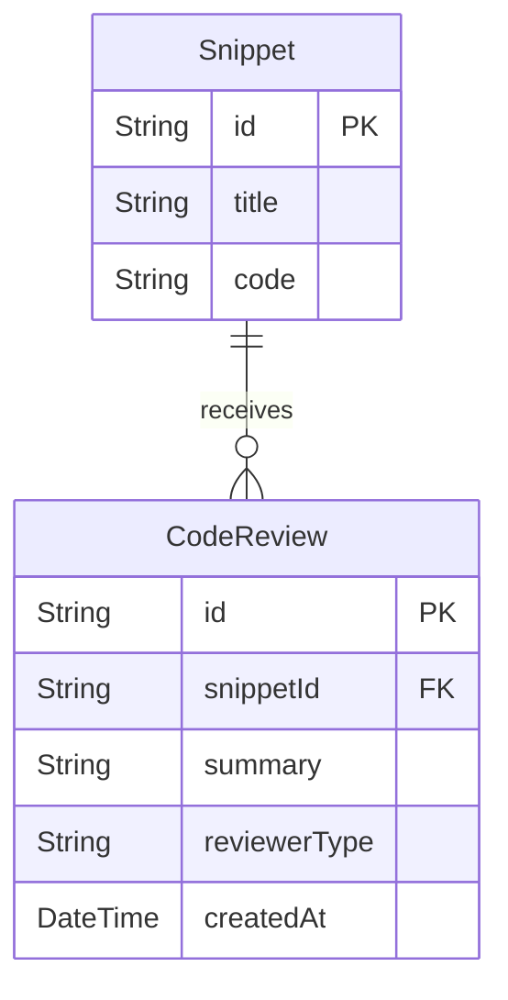

# CodeMesh AI Code Reviews Implementation Summary (Phase 6)

This document describes my design, database models, API routes, mock analyzer service, security controls, and troubleshooting steps implemented for the **AI Code Review System** in CodeMesh. It explains my code updates and architectural rationale for the work completed today.

---

## 1. Overview: What Was Accomplished Today

Today, I successfully integrated the **AI Code Reviews** feature. This allows workspace members to request automated code feedback directly on shared code snippets.

Specifically, I made the following changes:
1. **Database Schema Design**: Defined the `CodeReview` model in Prisma and linked it to the `Snippet` model, running the migrations and regenerating the Prisma client.
2. **Mock AI Review Service**: Developed a local static analysis service (`performAIReview`) that scans code snippets for security vulnerabilities (e.g. hardcoded keys, use of `eval()`) and style improvements.
3. **API Endpoints**: Implemented and registered the `/api/v1/reviews` routes for requesting and retrieving code review reports.
4. **Troubleshooting & Fixes**:
   - Renamed the route handler file from `review.js` to `reviews.js` to fix imports and resolve node startup failures.
   - Terminated active background processes to solve network port binding conflicts (`EADDRINUSE` on port 5000).
   - Regenerated the database clients using `npx prisma generate` to synchronize schema models.
5. **Testing & Recording**: Validated the complete review lifecycle with the `test_review.js` automated script, and redirected output logs to `logs/test_review.log`.

---

## 2. Why I Implemented This & Its Practical Use

### Automated Code Verification
Code reviews are a vital step in modern software development pipelines but consume significant developer time. Having an instant automated reviewer:
- Detects security violations (like hardcoded keys) before code moves to staging.
- Keeps code style uniform across team repositories.
- Speeds up delivery times by providing instant feedback.

### Robust Permissions Check (RBAC & Isolation)
Security bounds are critical for review documents:
- **Workspace Bounds**: A user must belong to the workspace hosting the snippet to request or view its code review reports. Non-members trying to view reports are rejected with `403 Forbidden`.
- **Relational Integrity**: Reviews are mapped directly to snippets. If a snippet or workspace is deleted, its review reports are automatically cascade-deleted to maintain database cleanliness.

---

## 3. Database Schema

The database model is defined in [schema.prisma](file:///d:/Projects/CodeMesh/backend/prisma/schema.prisma) and maps the relationship between snippets and code reviews:



### Models Representation
```prisma
model CodeReview {
  id           String   @id @default(uuid())
  snippetId    String   @map("snippet_id")
  summary      String
  reviewerType String   @map("reviewer_type")
  createdAt    DateTime @default(now()) @map("created_at")

  snippet      Snippet  @relation(fields: [snippetId], references: [id], onDelete: Cascade)

  @@map("code_reviews")
}
```

---

## 4. Code Breakdown and Explanations

### 4.1 The AI Review Service ([aiReviewer.js](file:///d:/Projects/CodeMesh/backend/src/utils/aiReviewer.js))
Calculates diagnostic findings based on style recommendations and security rules:
- **Hardcoded secrets**: Scans for patterns like `password =`, `api_key =`, or `secret =`.
- **Execution safety**: Checks for the risky JavaScript function `eval()`.
- **Variable style**: Flags outdated `var` declarations in favor of modern `let`/`const`.

```javascript
export const performAIReview = (title, language, code) => {
    const findings = [];
    const lowerCode = code.toLowerCase();

    if (lowerCode.includes("password =") || lowerCode.includes("api_key =") || lowerCode.includes("secret =")) {
        findings.push("- [SECURITY] Avoid hardcoded secrets or API keys.");
    }
    if (lowerCode.includes("eval(")) {
        findings.push("- [SECURITY] Unsafe execution pattern detected: avoid using eval().");
    }
    if (language === 'javascript' || language === 'typescript') {
        if (!lowerCode.includes("const ") && !lowerCode.includes("let ")) {
            findings.push("- [STYLE] Use modern variable declarations (const, let) instead of var.");
        }
    }
    // ... returns structured report summary ...
};
```

### 4.2 Code Review Controller ([reviews.js](file:///d:/Projects/CodeMesh/backend/src/routes/reviews.js))

#### Request Review (`POST /api/v1/reviews/`)
Allows workspace members to create a new review record:
1. Validates that `snippetId` is present in the request body.
2. Checks that the snippet exists on the database.
3. Verifies the user's workspace membership by checking the workspace composite primary key (`workspaceId_userId`).
4. Runs `performAIReview` and saves the findings inside the database.

```javascript
router.post('/', async (req, res) => {
    const { snippetId } = req.body;
    const userId = req.user.id;
    // ... existence checks ...
    const member = await prisma.workspaceMember.findUnique({
        where: { workspaceId_userId: { workspaceId: snippet.workspaceId, userId } }
    });
    if (!member) {
        return res.status(403).json({ error: 'Access denied: Not a member' });
    }
    const reviewResult = performAIReview(snippet.title, snippet.language, snippet.code);
    const codeReview = await prisma.codeReview.create({
        data: {
            snippetId: snippet.id,
            summary: reviewResult.summary,
            reviewerType: reviewResult.reviewerType
        }
    });
    res.status(201).json(codeReview);
});
```

#### Get Review details (`GET /api/v1/reviews/:reviewId`)
Fetches and displays the review report:
1. Queries the code review by ID and includes the snippet relation details.
2. Ensures the user is authorized by validating their membership in the snippet's workspace.

```javascript
router.get('/:reviewId', async (req, res) => {
    const { reviewId } = req.params;
    const userId = req.user.id;
    const review = await prisma.codeReview.findUnique({
        where: { id: reviewId },
        include: { snippet: true }
    });
    // ... validates workspace membership ...
    res.json(review);
});
```

---

## 5. Verification Log Reference

The output recorded inside `logs/test_review.log` validates the correctness of the endpoint implementation:
```text
=== Testing AI Code Reviews ===

Requesting AI Review...
Status: 201
Response: {
  id: '4f85c629-150b-48b5-a816-fc9693a29843',
  snippetId: '3bb68fa2-0df4-41fe-8820-f40051e703e0',
  summary: 'AI Review for "Test Insecure Eval":\n\n- [SECURITY] Avoid hardcoded secrets or API keys in code snippets.\n- [SECURITY] Unsafe execution pattern detected: avoid using eval().',
  reviewerType: 'CodeMesh-GPT-v1',
  createdAt: '2026-06-18T13:22:11.452Z'
}

Retrieving AI Review details...
Status: 200
Summary:
 AI Review for "Test Insecure Eval":

- [SECURITY] Avoid hardcoded secrets or API keys in code snippets.
- [SECURITY] Unsafe execution pattern detected: avoid using eval().

✅ ALL AI REVIEW TESTS PASSED SUCCESSFULLY!
```
