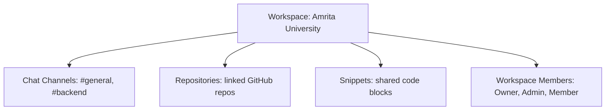

# CodeMesh: New Developer Orientation & Quick-Start Guide

Welcome to the **CodeMesh** team! If you are a new developer joining the project, this guide is written specifically for you to remove all initial confusion about how CodeMesh functions, how our files are structured, and how we collaborate daily. No complex jargon—just practical clarity.

---

## What is CodeMesh?
CodeMesh is a collaborative workspace built specifically for software developers. Think of it as a hybrid that merges the features of:
* **GitHub** (code storage & reviews)
* **Slack** (instant messaging)
* **Jira** (team workflow management)

It solves the problem of "communication fragmentation" by letting developers chat, review code, use AI helpers, and trace changes all in a single application.

---

## 1. The Structure (The Digital Building)
CodeMesh organizes everything directly into a Workspace. You can visualize it like this:



### The Workspace
A **Workspace** is the highest-level bucket (like your company or university). Everything else (repositories, chat rooms, snippets) exists directly inside this workspace. 

### Members & Roles
When users join a workspace, they are assigned a job role:
* **Owner:** Has complete control (create projects, link GitHub, add/remove members).
* **Admin:** Helps run operations (moderate channels, invite members, review pull requests).
* **Member:** A developer who writes code, chats, and requests reviews.

*Note: Roles are specific to each workspace. You can be an Owner in one workspace, but just a regular Member in another.*

#### 📝 Real-World Example of a Workspace Setup:
Imagine your company is called **"Amrita Devs"**:
1. You create one workspace: **Amrita Devs Workspace**.
2. Inside it, you import two repositories: `student-portal-backend` and `student-portal-frontend`.
3. You create three chat channels: `#general` (for team announcements), `#dev-backend` (for backend talks), and `#dev-frontend` (for design talks).
4. All team members join this workspace. Now, any developer can discuss frontend design in `#dev-frontend` and view the code changes in the `student-portal-backend` repository all in one central screen.

---

## 2. Repositories vs. Channels (How they connect)
A common question is how **repositories (repos)** and **channels (chat rooms)** connect.

```text
               ┌───────────────────────┐
               │       WORKSPACE       │
               │   (Our Office Space)  │
               └───────────┬───────────┘
                           │
             ┌─────────────┴─────────────┐
             ▼                           ▼
      ┌──────────────┐            ┌──────────────┐
      │  REPOSITORIES│            │   CHANNELS   │
      │ (Code Folders│            │ (Chat Rooms) │
      │  from GitHub)│            │ for Texting  │
      └──────────────┘            └──────────────┘
```

They are **not directly linked inside the database**, but they connect through the **Workspace** and the **Notification system**:
* **Repositories (Repos):** These are the actual code folders imported from GitHub. They contain the code files and history.
* **Channels (Chat Rooms):** These are messaging rooms where you type messages.
* **The Connection:** When a change is made in a **Repository** (like submitting a Pull Request), the system broadcasts an update to the **Channel** in that workspace so developers can instantly chat about it.

### Common Questions & Setup Rules
* **Do I need a new Workspace for every Repository?**
  No! A Workspace is a container. A single Workspace can hold **multiple repositories** at the same time. For example, your workspace could contain your `backend` repo, `frontend` repo, and `mobile-app` repo all in one place.
* **Can I have separate Chat Channels for each Repository?**
  Yes! Because chat channels and repositories both exist under the same Workspace, you can create separate channels specifically to talk about different repositories (e.g., `#repo-backend` and `#repo-frontend`) to keep conversations clean and structured.

---

## 3. The Developer Workflow
Here is how a developer uses CodeMesh to get code approved:

```text
  Create Code
       │
       ▼
  Submit Pull Request (linked to real GitHub PR)
       │
       ▼
  AI Review & Human Review (comments left inside CodeMesh)
       │
       ▼
  Discussion & Code Edits (resolved via thread)
       │
       ▼
  Code Approved -> Merged
```

### 1. Connecting GitHub
Developers connect their GitHub account to CodeMesh. This allows CodeMesh to sync their **Repositories** and active **Pull Requests** (proposals for code changes).

### 2. Actual Pull Request Connection
* CodeMesh stores the direct link (`htmlUrl`) to the actual Pull Request on GitHub.com.
* You can click a button in CodeMesh to open that exact pull request on the GitHub website to do final merges.

### 3. Reviewing Code & Chatting
* **AI Code Assistant:** Developers can ask the built-in AI helper to scan their code snippets for security bugs or performance issues.
* **Inline Comments (Line-by-Line Feedback):** 
  Instead of writing a general review note, reviewers can click directly on a specific line of code (for example, where a password might be hardcoded) and write a comment. This comment pops up right under that specific line, keeping feedback tied to the exact context.
* **Threaded Discussions (Conversations on Code):** 
  Directly under each inline comment, a nested chat thread is created. Developers and reviewers can have a conversation back-and-forth (e.g., explaining why a line was written that way or asking for suggestions on how to improve it). Once the issue is resolved, the thread can be marked as "Resolved" to collapse it.

#### 📝 Real-World Example of Inline Comments & Threads in Action:

1. **Step 1:** Developer *John Doe* submits a code snippet for review.
2. **Step 2:** Reviewer *Alex* opens the code, looks at line 14, and notices a security issue:
   ```javascript
   12: function connectDatabase() {
   13:     // TODO: Move to config variables
   14:     const dbPassword = "admin_password123"; 
   15:     return db.connect(dbPassword);
   16: }
   ```
   Alex clicks directly on **Line 14** and writes an **Inline Comment**:
   > **Alex:** "Security risk: Please do not write plain text passwords in code files. We should load this from environment variables instead."
3. **Step 3:** A **Threaded Discussion** starts directly under Line 14:
   > **John Doe (Developer):** "Ah, you're right. Should I use `process.env.DB_PASSWORD` here?"
   >
   > **Alex (Reviewer):** "Yes, that's perfect! Ensure you update the `.env.example` file too so other developers know to add it."
   >
   > **John Doe (Developer):** "Done. I updated the code to use the environment variable and pushed the change."
4. **Step 4:** Alex clicks **"Resolve"** on the thread. The discussion collapses, and the code change is approved!

---

## 4. Key Confusions Cleared Up (FAQ for New Developers)
Before you start coding, read these quick clarifications to avoid common beginner misunderstandings:

* **Is a "Project" separate from a Workspace or a Channel?**
  * **Answer:** *No.* In the actual database design, there is no separate "Project" table. Everything (repositories, channels, and code snippets) sits directly inside the **Workspace**. The Workspace acts as the single boundary for your team's code, chat, and members.
* **Do I need a new Workspace for every Repository?**
  * **Answer:** *No.* A single Workspace can house multiple repositories. You do not need to create a new workspace just to add another repository.
* **Are my review comments pushed back to GitHub's website?**
  * **Answer:** *No.* Review comments, inline comments, and discussions created inside CodeMesh are saved locally in CodeMesh's database to keep collaboration fast and contained.
* **How do I connect CodeMesh to the actual GitHub Pull Request?**
  * **Answer:** CodeMesh syncs the Pull Request's title, number, and status, and stores a direct link (`htmlUrl`) to the real Pull Request on GitHub.com. You can click a button inside CodeMesh to jump directly to the real GitHub page when you are ready to do the final code merge.
* **Where does the "Human Review" happen? Is it inside the GitHub section?**
  * **Answer:** **Yes!** Human code reviews take place inside the **GitHub/Repository** section of the workspace. When you sync a repository, CodeMesh lists the active **Pull Requests** (which represent the code updates). Reviewers can click on a Pull Request, inspect the code, and leave inline comments. *(Alternatively, developers can share standalone "Snippets" inside the workspace and request a human code review by sharing a link in a chat channel).*
## 5. Technical Implementation: How It Works Under the Hood

To help you get comfortable with our codebase, here is a quick overview of how these ideas are implemented on a code level:

### A. Workspaces & Access Control
* **Database Modeling:** We use a relational PostgreSQL database managed via **Prisma ORM**. The data is split into two tables: `workspaces` (to store workspace details) and `workspace_members` (a mapping table linking users to workspaces with a specific `Role` enum: `OWNER`, `ADMIN`, or `MEMBER`).
* **Route Protection:** In the backend, we use custom middleware. For example, in [workspaces.js](file:///d:/Projects/CodeMesh/backend/src/routes/workspaces.js), when a user requests workspace data, the middleware queries the `workspace_members` table to verify membership. If the caller isn't a member, the API blocks the request with a `403 Forbidden` response.

### B. Live Chat & Socket.IO
* **Connection Lifecycle:** When a user opens their dashboard, a persistent **Socket.IO (WebSocket)** connection is opened between their React frontend and the Express backend.
* **Message Delivery:** When you post a message, the frontend sends a socket event. The backend intercepts this event, saves the message in the `Message` table (for chat history), and instantly broadcasts it to all other active sockets listening to that specific channel ID. This handles live typing indicators and online/offline status in real-time.

### C. GitHub Sync
* **Account Linkage:** Users store their GitHub connection credentials in the `github_connections` table.
* **Synchronizer Service:** In [github.js](file:///d:/Projects/CodeMesh/backend/src/routes/github.js), when the sync endpoint (`/api/v1/github/sync`) is triggered, the backend fetches repositories and pull requests from GitHub (simulated in development) and inserts/updates them in the `Repository` and `PullRequest` database tables. We store the direct repository web URL (`htmlUrl`) to allow users to navigate back to GitHub.

### D. Inline Comments & Threaded Discussions
* **Database Relations:** 
  * `review_comments`: Stores the comment content, and keeps track of the snippet, file, and the specific line number.
  * `discussion_threads`: A thread record generated when the first inline comment is posted.
  * `thread_messages`: Individual nested reply records referencing the thread ID.
* **Rendering on the Frontend:** The frontend parses the code file, looks up the list of comments matching the file name, and inserts the chat thread component dynamically directly below the corresponding line index.

### E. AI Review Assistant
* **Implementation:** The AI reviewer is driven by a helper function `performAIReview` in [aiReviewer.js](file:///d:/Projects/CodeMesh/backend/src/utils/aiReviewer.js). It takes the code string, runs scans for specific unsafe patterns (such as evaluating dynamic code using `eval()`, hardcoded secrets, or style violations like `var`), and creates a code review result record in the `CodeReview` table.

---

## Summary of Features
* **Real-time Chat:** Chat rooms with online status, read receipts, and typing indicators.
* **AI Assistance:** Automated scanning for code quality.
* **GitHub Syncing:** Link real-world repositories and pull requests to your workspace.
* **Analytics Dashboard:** Visual tracking showing average code approval times and team productivity leaderboards.
