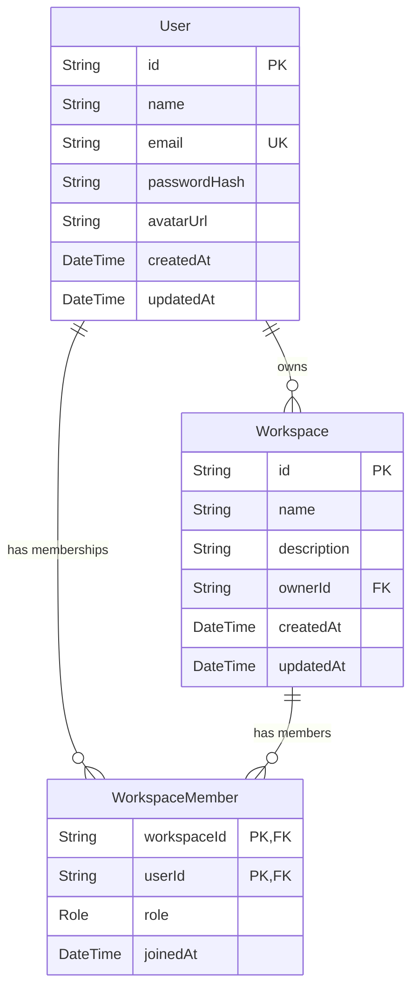

# CodeMesh Workspace & Member Management Summary

This document compiles the complete details of today's work implementing the **Workspace and Member Management APIs**. It describes the system architecture, database design, files modified, specific endpoints built, code explanations, and structural rationales.

---

## 1. Overview of Today's Work

The primary objective of today's development was to establish **Workspace Isolation and Member Access Control** within CodeMesh. Workspaces are the highest-level organizational boundaries where teams share source files and collaborate. 

Today we built:
1. **Workspace Lifecycle Endpoints**: Allow users to create, fetch, update, and delete workspaces.
2. **Access Control List (ACL) & Role Management**: Enable Owners and Admins to invite and remove members.
3. **Route Integration**: Registered the route module in the main server app file.
4. **Validation Test suite**: Validated permissions, role constraints, and transaction rollback properties.

---

## 2. Database Schema Reference

The tables and relationships utilized during this phase are defined in [schema.prisma](file:///d:/Projects/CodeMesh/backend/prisma/schema.prisma):



### Architectural Highlights
- **UUID Keys**: Prevents sequential ID enumerations, protecting against dictionary-scanning/ID-enumeration attacks.
- **Relational Role Mapping**: Storing the user `role` in the relation table (`WorkspaceMember`) rather than on the `User` model allows a single user to be an `OWNER` in Workspace A, an `ADMIN` in Workspace B, and a regular `MEMBER` in Workspace C.
- **On-Delete Cascades**: If a workspace is deleted, all membership links mapping users to that workspace are automatically cleared to keep the database tidy.

---

## 3. Registered Endpoint Map

All routes require authentication and are registered under the `/api/v1/workspaces` prefix in [index.js](file:///d:/Projects/CodeMesh/backend/src/index.js):

| Route Method | Path Pattern | Description | Required Role |
| :--- | :--- | :--- | :--- |
| **POST** | `/` | Create a new Workspace | Authenticated User |
| **GET** | `/` | Fetch all Workspaces current user belongs to | Member/Admin/Owner |
| **GET** | `/:workspaceId` | Fetch single Workspace details with its member list | Member/Admin/Owner |
| **PUT** | `/:workspaceId` | Update Workspace details (name / description) | Owner |
| **DELETE** | `/:workspaceId` | Delete Workspace and cascade delete members | Owner |
| **GET** | `/:workspaceId/members` | Get list of members in a workspace | Member/Admin/Owner |
| **POST** | `/:workspaceId/members` | Add user to workspace by email | Admin/Owner |
| **DELETE** | `/:workspaceId/members/:userId` | Remove user from workspace | Admin/Owner |

---

## 4. Code Breakdown & Technical Explanations

Here is the exact code implemented in [workspaces.js](file:///d:/Projects/CodeMesh/backend/src/routes/workspaces.js), divided by module, along with explanation summaries.

### 4.1 Router Setup & Middleware Application
We import Express, the shared Prisma client, and our custom JWT-validation middleware. We apply the middleware to all routes inside this file.
```javascript
import express from 'express';
import { prisma } from '../lib/prisma.js';
import { authenticateToken } from '../middleware/auth.js';

const router = express.Router();

// Apply authentication middleware to all routes in this router
router.use(authenticateToken);
```
- **`router.use(authenticateToken)`**: Guarantees that any request entering this router must contain a valid JWT header (`Authorization: Bearer <token>`). If the token is invalid or missing, it returns `401 Unauthorized` or `403 Forbidden` and short-circuits the handler.

---

### 4.2 Workspace Operations

#### 4.2.1 Create Workspace
```javascript
router.post('/', async (req, res) => {
    const { name, description } = req.body;
    const userId = req.user.id; // Extracted by authenticateToken middleware

    if (!name) {
        return res.status(400).json({ error: 'Workspace name is required' });
    }

    try {
        const result = await prisma.$transaction(async (tx) => {
            // 1. Create workspace
            const workspace = await tx.workspace.create({
                data: {
                    name,
                    description,
                    ownerId: userId,
                },
            });

            // 2. Add owner to workspace memberships
            const membership = await tx.workspaceMember.create({
                data: {
                    workspaceId: workspace.id,
                    userId: userId,
                    role: 'OWNER',
                },
            });

            return { workspace, membership };
        });

        res.status(201).json({
            message: 'Workspace created successfully',
            workspace: result.workspace,
        });
    } catch (error) {
        res.status(500).json({ error: error.message });
    }
});
```
* **Explanation**: Receives the workspace `name` and `description` from `req.body`. We run the creation logic inside `prisma.$transaction`. 
* **Design Decision**: A database transaction is critical here. It ensures that the workspace record and the corresponding membership record are committed *together*. If adding the owner record fails, the workspace creation is automatically rolled back, leaving no database residues.

#### 4.2.2 Fetch User's Workspaces
```javascript
router.get('/', async (req, res) => {
    const userId = req.user.id;

    try {
        const workspaces = await prisma.workspace.findMany({
            where: {
                members: {
                    some: {
                        userId: userId,
                    },
                },
            },
            include: {
                members: {
                    select: {
                        role: true,
                        joinedAt: true,
                        user: {
                            select: {
                                id: true,
                                name: true,
                                email: true,
                                avatarUrl: true,
                            },
                        },
                    },
                },
            },
        });

        res.json(workspaces);
    } catch (error) {
        res.status(500).json({ error: error.message });
    }
});
```
* **Explanation**: Returns all workspaces where the current user matches any record in `members`. We use `include` to load member details (excluding user password hashes).

#### 4.2.3 Fetch Single Workspace
```javascript
router.get('/:workspaceId', async (req, res) => {
    const { workspaceId } = req.params;
    const userId = req.user.id;

    try {
        // 1. Verify user membership in this workspace
        const member = await prisma.workspaceMember.findUnique({
            where: {
                workspaceId_userId: {
                    workspaceId,
                    userId,
                },
            },
        });

        if (!member) {
            return res.status(403).json({ error: 'Access denied: You are not a member of this workspace' });
        }

        // 2. Retrieve workspace details
        const workspace = await prisma.workspace.findUnique({
            where: { id: workspaceId },
            include: {
                members: {
                    select: {
                        role: true,
                        joinedAt: true,
                        user: {
                            select: {
                                id: true,
                                name: true,
                                email: true,
                                avatarUrl: true,
                            },
                        },
                    },
                },
            },
        });

        if (!workspace) {
            return res.status(404).json({ error: 'Workspace not found' });
        }

        res.json(workspace);
    } catch (error) {
        res.status(500).json({ error: error.message });
    }
});
```
* **Explanation**: First validates that the calling user belongs to the workspace by looking up the composite PK `workspaceId_userId` in `workspace_members`. If not, we return `403 Forbidden` to prevent random metadata scanning.

#### 4.2.4 Update Workspace
```javascript
router.put('/:workspaceId', async (req, res) => {
    const { workspaceId } = req.params;
    const { name, description } = req.body;
    const userId = req.user.id;

    try {
        const workspace = await prisma.workspace.findUnique({
            where: { id: workspaceId },
        });

        if (!workspace) {
            return res.status(404).json({ error: 'Workspace not found' });
        }

        if (workspace.ownerId !== userId) {
            return res.status(403).json({ error: 'Access denied: Only the workspace owner can update it' });
        }

        const updatedWorkspace = await prisma.workspace.update({
            where: { id: workspaceId },
            data: {
                name: name !== undefined ? name : workspace.name,
                description: description !== undefined ? description : workspace.description,
            },
        });

        res.json({
            message: 'Workspace updated successfully',
            workspace: updatedWorkspace,
        });
    } catch (error) {
        res.status(500).json({ error: error.message });
    }
});
```
* **Explanation**: Validates that the database record's `ownerId` matches the token's authenticated `userId`. We also use ternary null-checks (`!== undefined`) so callers can selectively update individual fields (e.g. only name or only description) without wiping other fields.

#### 4.2.5 Delete Workspace
```javascript
router.delete('/:workspaceId', async (req, res) => {
    const { workspaceId } = req.params;
    const userId = req.user.id;

    try {
        const workspace = await prisma.workspace.findUnique({
            where: { id: workspaceId },
        });

        if (!workspace) {
            return res.status(404).json({ error: 'Workspace not found' });
        }

        if (workspace.ownerId !== userId) {
            return res.status(403).json({ error: 'Access denied: Only the workspace owner can delete it' });
        }

        await prisma.workspace.delete({
            where: { id: workspaceId },
        });

        res.json({ message: 'Workspace deleted successfully' });
    } catch (error) {
        res.status(500).json({ error: error.message });
    }
});
```
* **Explanation**: Validates owner authority before deleting the workspace. Under-the-hood, database keys configured with `onDelete: Cascade` delete all entries referencing this workspace automatically.

---

### 4.3 Workspace Member Operations

#### 4.3.1 List Members
```javascript
router.get('/:workspaceId/members', async (req, res) => {
    const { workspaceId } = req.params;
    const userId = req.user.id;

    try {
        const callerMember = await prisma.workspaceMember.findUnique({
            where: {
                workspaceId_userId: {
                    workspaceId,
                    userId,
                },
            },
        });

        if (!callerMember) {
            return res.status(403).json({ error: 'Access denied: You are not a member of this workspace' });
        }

        const members = await prisma.workspaceMember.findMany({
            where: { workspaceId },
            select: {
                role: true,
                joinedAt: true,
                user: {
                    select: {
                        id: true,
                        name: true,
                        email: true,
                        avatarUrl: true,
                    },
                },
            },
        });

        res.json(members);
    } catch (error) {
        res.status(500).json({ error: error.message });
    }
});
```
* **Explanation**: Allows any authenticated member of the workspace to request the complete list of participants (useful for display in chat sidebars or pull-request reviewers selectors).

#### 4.3.2 Invite/Add Member
```javascript
router.post('/:workspaceId/members', async (req, res) => {
    const { workspaceId } = req.params;
    const { email, role } = req.body;
    const userId = req.user.id;

    if (!email) {
        return res.status(400).json({ error: 'User email is required' });
    }

    const validRoles = ['ADMIN', 'MEMBER'];
    const memberRole = role ? role.toUpperCase() : 'MEMBER';
    if (role && !validRoles.includes(memberRole)) {
        return res.status(400).json({ error: 'Invalid role. Role must be ADMIN or MEMBER' });
    }

    try {
        const callerMember = await prisma.workspaceMember.findUnique({
            where: {
                workspaceId_userId: {
                    workspaceId,
                    userId,
                },
            },
        });

        if (!callerMember || (callerMember.role !== 'OWNER' && callerMember.role !== 'ADMIN')) {
            return res.status(403).json({ error: 'Access denied: Only owners and admins can invite members' });
        }

        const userToAdd = await prisma.user.findUnique({
            where: { email },
        });

        if (!userToAdd) {
            return res.status(404).json({ error: 'User with this email not found' });
        }

        const existingMember = await prisma.workspaceMember.findUnique({
            where: {
                workspaceId_userId: {
                    workspaceId,
                    userId: userToAdd.id,
                },
            },
        });

        if (existingMember) {
            return res.status(400).json({ error: 'User is already a member of this workspace' });
        }

        const newMember = await prisma.workspaceMember.create({
            data: {
                workspaceId,
                userId: userToAdd.id,
                role: memberRole,
            },
            select: {
                role: true,
                joinedAt: true,
                user: {
                    select: {
                        id: true,
                        name: true,
                        email: true,
                    },
                },
            },
        });

        res.status(201).json({
            message: 'Member added successfully',
            member: newMember,
        });
    } catch (error) {
        res.status(500).json({ error: error.message });
    }
});
```
* **Explanation**: Allows only `OWNER` or `ADMIN` callers to add another user (identified by their unique email). It maps the user to the workspace under a transaction lock and verifies that they aren't duplicate entries.

#### 4.3.3 Remove Member
```javascript
router.delete('/:workspaceId/members/:userId', async (req, res) => {
    const { workspaceId, userId: targetUserId } = req.params;
    const callerId = req.user.id;

    try {
        const callerMember = await prisma.workspaceMember.findUnique({
            where: {
                workspaceId_userId: {
                    workspaceId,
                    userId: callerId,
                },
            },
        });

        if (!callerMember || (callerMember.role !== 'OWNER' && callerMember.role !== 'ADMIN')) {
            return res.status(403).json({ error: 'Access denied: Only owners and admins can remove members' });
        }

        const targetMember = await prisma.workspaceMember.findUnique({
            where: {
                workspaceId_userId: {
                    workspaceId,
                    userId: targetUserId,
                },
            },
        });

        if (!targetMember) {
            return res.status(404).json({ error: 'Member not found in this workspace' });
        }

        if (targetMember.role === 'OWNER') {
            return res.status(400).json({ error: 'Cannot remove the owner of the workspace' });
        }

        if (callerMember.role === 'ADMIN' && targetMember.role === 'ADMIN') {
            return res.status(403).json({ error: 'Access denied: Workspace admins cannot remove other admins' });
        }

        await prisma.workspaceMember.delete({
            where: {
                workspaceId_userId: {
                    workspaceId,
                    userId: targetUserId,
                },
            },
        });

        res.json({ message: 'Member removed successfully' });
    } catch (error) {
        res.status(500).json({ error: error.message });
    }
});
```
* **Explanation**: Controls who can kick who:
  - Caller must be `OWNER` or `ADMIN`.
  - The Owner cannot be kicked (`role === OWNER` is blocked).
  - Admins cannot kick other Admins (only Owners have permission to demote or remove Admins).

---

## 5. Security & Verification Strategy

### Core Security Checks Implemented
- **Caller Membership Check**: Prevents non-members from extracting user rosters or listing workspace metadata.
- **Nullish Property Updates**: Ensures updates target only provided body keys.
- **Admin Isolation Bounds**: Restricts Admin authority to prevent workspace hijackings.
- **Email Bounds Check**: Provides descriptive API returns when attempting to add unregistered users to a workspace.
