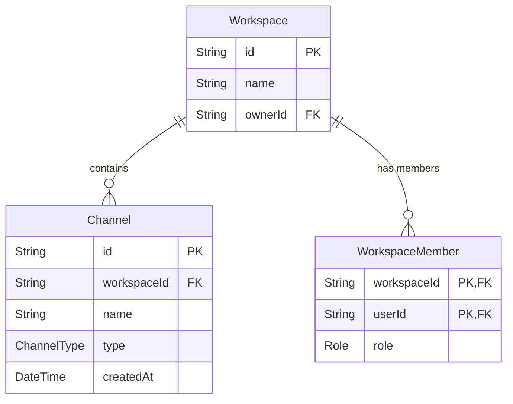

# CodeMesh Channel Management Implementation Summary

This document describes the design, database models, API routes, security controls, and verification strategy implemented for the **Channel Management System** in CodeMesh (Phase 3). It details the code updates, architectural decisions, and setup instructions.

---

## 1. Overview of the Channel System

Channels are sub-sections of a workspace dedicated to communication or review activities. The system guarantees that:
1. **Lobby Initialization**: Every workspace is created with a default, undeletable `#general` channel.
2. **Role-Based Security**: Workspace regular members can view and join channels, but only **Owners** and **Admins** can create or delete channels.
3. **Unique Naming Rules**: Channel names within the same workspace must be unique (checked case-insensitively) to prevent confusing duplicate channels.
4. **Data Cascades**: Deleting a workspace automatically deletes all channels associated with it.

---

## 2. Updated Database Schema

The database models defined in [schema.prisma](file:///d:/Projects/CodeMesh/backend/prisma/schema.prisma) are updated as follows:



### Models Syntax Reference
```prisma
enum ChannelType {
  GENERAL
  CHAT
  CODE_REVIEW
}

model Channel {
  id          String      @id @default(uuid())
  workspaceId String      @map("workspace_id")
  name        String
  type        ChannelType @default(CHAT)
  createdAt   DateTime    @default(now()) @map("created_at")

  workspace   Workspace   @relation(fields: [workspaceId], references: [id], onDelete: Cascade)

  @@unique([workspaceId, name])
  @@map("channels")
}
```

### Key DB Decisions
* **Composite Uniqueness (`@@unique([workspaceId, name])`)**: This constraint operates at the database level. It permits multiple workspaces to have a channel named `#general`, but blocks a single workspace from creating duplicate `#general` channels.
* **Cascading Delete (`onDelete: Cascade`)**: Configures PostgreSQL to automatically delete all channel rows referencing a workspace when that workspace is deleted, preventing orphan rows.

---

## 3. Registered API Endpoint Map

All routes require authentication and are registered under the `/api/v1/channels` prefix in [index.js](file:///d:/Projects/CodeMesh/backend/src/index.js):

| Route Method | Path Pattern | Description | Required Workspace Role |
| :--- | :--- | :--- | :--- |
| **POST** | `/` | Create a new channel | Owner / Admin |
| **GET** | `/` | List all channels in a workspace | Member / Admin / Owner |
| **DELETE** | `/:channelId` | Delete a custom channel | Owner / Admin |

---

## 4. Detailed Code Breakdown

### 4.1 Automatic Default Channel Creation
In [workspaces.js](file:///d:/Projects/CodeMesh/backend/src/routes/workspaces.js), we updated the creation transaction so that new workspaces are provisioned with a default channel:
```javascript
const result = await prisma.$transaction(async (tx) => {
    // 1. Create workspace
    const workspace = await tx.workspace.create({
        data: { name, description, ownerId: userId },
    });

    // 2. Add creator as OWNER
    const membership = await tx.workspaceMember.create({
        data: { workspaceId: workspace.id, userId: userId, role: 'OWNER' },
    });

    // 3. Create default general channel
    const channel = await tx.channel.create({
        data: {
            workspaceId: workspace.id,
            name: 'general',
            type: 'GENERAL',
        },
    });

    return { workspace, membership, channel };
});
```
* **Rationale**: Wrapping these three steps inside `prisma.$transaction` guarantees database integrity. If the channel creation fails, the transaction is rolled back, and the workspace database entry is discarded.

### 4.2 Channel Management Router ([channels.js](file:///d:/Projects/CodeMesh/backend/src/routes/channels.js))

#### 4.2.1 Create Channel (`POST /`)
Allows Owners and Admins to register a new channel name inside their workspace:
```javascript
// Verify user membership and role permissions
const member = await prisma.workspaceMember.findUnique({
    where: { workspaceId_userId: { workspaceId, userId } },
});

if (!member || (member.role !== 'OWNER' && member.role !== 'ADMIN')) {
    return res.status(403).json({ error: 'Access denied: Only workspace owners and admins can create channels' });
}

// Case-insensitive duplicate name check
const existingChannel = await prisma.channel.findFirst({
    where: {
        workspaceId,
        name: { equals: name.trim(), mode: 'insensitive' },
    },
});

if (existingChannel) {
    return res.status(400).json({ error: `A channel with the name "${name.trim()}" already exists` });
}
```
* **Case Insensitivity**: Performing `.findFirst` with `mode: 'insensitive'` checks for name collisions, blocking variations like `devops` and `DevOps`.

#### 4.2.2 List Channels (`GET /`)
Lists the active channels in a workspace. Accessible by any valid workspace member:
```javascript
// Verify membership before retrieving channels list
const member = await prisma.workspaceMember.findUnique({
    where: { workspaceId_userId: { workspaceId, userId } },
});

if (!member) {
    return res.status(403).json({ error: 'Access denied: You are not a member of this workspace' });
}

const channels = await prisma.channel.findMany({
    where: { workspaceId },
    orderBy: { createdAt: 'asc' },
});
```
* **Security**: Blocks users from accessing metadata and lists of channels belonging to workspaces they do not belong to.

#### 4.2.3 Delete Channel (`DELETE /:channelId`)
Deletes a channel by ID. Blocks deleting default general channels:
```javascript
// Prevent deleting GENERAL channel
if (channel.type === 'GENERAL') {
    return res.status(400).json({ error: 'Access denied: Cannot delete the default general channel' });
}
```
* **Safety Rules**: Checks if `channel.type` matches `GENERAL` and rejects the deletion with a `400 Bad Request` to guarantee every workspace retains its default channel lobby.

---

## 5. Security and Access Control Matrix

| API Action | Path | Expected Constraints Verified |
| :--- | :--- | :--- |
| **Create Channel** | `POST /` | Caller is a workspace member AND has role `OWNER` or `ADMIN`. Name does not conflict insensitively. |
| **List Channels** | `GET /` | Caller is a valid member of the workspace (any role). |
| **Delete Channel** | `DELETE /:channelId` | Caller is a workspace member AND has role `OWNER` or `ADMIN`. Channel type is NOT `GENERAL`. |

---

## 6. Verification Plan

### Test Script ([test_channels.js](file:///d:/Projects/CodeMesh/backend/test_channels.js))
An automated test script has been created in the backend root directory. It runs sequential checks to verify:
1. **Auto-Creation**: Creating a workspace automatically instantiates the `general` channel.
2. **Access Control**: Regular workspace members are blocked from creating or deleting channels.
3. **Validation**: Submitting duplicate channel names or trying to delete the `general` channel fails with descriptive validation errors.
4. **Lifecycle Complete**: Deleting a custom channel works successfully for owners, and deleting workspaces cascades correctly.

To run the test suite locally:
1. Start the server:
   ```bash
   npm run dev
   ```
2. Execute the verification tests:
   ```bash
   node test_channels.js
   ```
