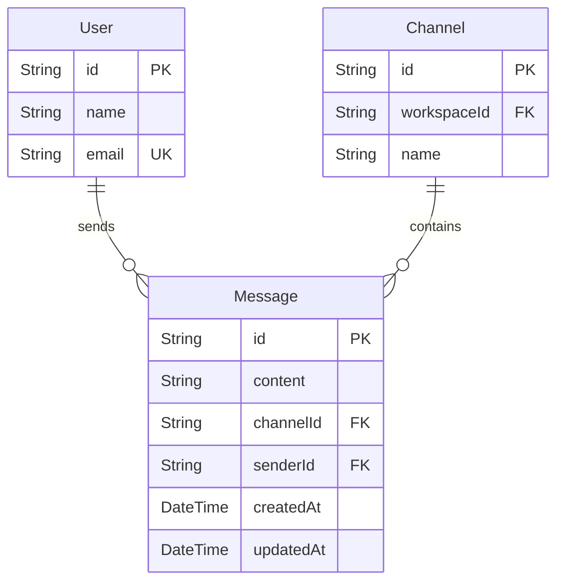

# CodeMesh Real-Time Chat & Message Management Summary (Phase 4)

This document describes the design, database models, API routes, WebSocket event handlers, security controls, and integration implemented for the **Real-Time Chat & Message Management System** in CodeMesh. It explains the code logic and architectural decisions behind the implementation.

---

## 1. Overview of Phase 4

The main objective of Phase 4 was to transition CodeMesh from a static workspace registry to an interactive, real-time collaboration environment. This phase covers:
1. **Message History Persistence**: Creating database relations for storing rich text messages inside channels.
2. **Access-Controlled Message Retrieval**: Exposing a REST API endpoint to pull channel message history only for users belonging to the corresponding workspace.
3. **JWT-Secured WebSocket Connection**: Establishing a Socket.IO connection that verifies users' identity via JWT.
4. **Isolated Channel Rooms**: Restricting real-time messages and presence information to channel-specific rooms, ensuring users only receive updates from channels they have access to.
5. **Real-Time Features**: Implementing bi-directional events for sending messages and broadcasting typing indicators (`typing_started` / `typing_stopped`).

---

## 2. Updated Database Schema

The database models defined in [schema.prisma](file:///d:/Projects/CodeMesh/backend/prisma/schema.prisma) are updated to introduce the `Message` model:



### Prisma Syntax & Relations
```prisma
model User {
  id           String            @id @default(uuid())
  ...
  messages     Message[]         // 1-to-many relation back to messages sent by this user
  @@map("users")
}

model Channel {
  id          String      @id @default(uuid())
  ...
  messages    Message[]   // 1-to-many relation back to messages sent in this channel
  @@map("channels")
}

model Message {
  id        String   @id @default(uuid())
  content   String
  channelId String   @map("channel_id")
  senderId  String   @map("sender_id")
  createdAt DateTime @default(now()) @map("created_at")
  updatedAt DateTime @updatedAt @map("updated_at")

  channel   Channel  @relation(fields: [channelId], references: [id], onDelete: Cascade)
  sender    User     @relation(fields: [senderId], references: [id], onDelete: Cascade)

  @@map("messages")
}
```

### Architectural DB Decisions:
* **Relational Arrays**: `messages Message[]` was added to `User` and `Channel` to reflect the 1-to-many relationships. *(Note: It was removed from `Workspace` since messages belong strictly to individual channels, not to the workspace directly).*
* **Cascading Delete (`onDelete: Cascade`)**: If a user is deleted or a channel is deleted, all associated messages are deleted automatically by PostgreSQL to prevent dangling data or reference errors.

---

## 3. Message History Router ([messages.js](file:///d:/Projects/CodeMesh/backend/src/routes/messages.js))

This router retrieves historical data when a member logs into a channel, allowing them to scroll through past discussions.

### API Definition
| Route Method | Path Pattern | Description | Required Role / Constraint |
| :--- | :--- | :--- | :--- |
| **GET** | `/api/v1/channels/:channelId/messages` | Fetch messages for a specific channel | Authenticated user MUST belong to the channel's workspace |

### Code Implementation & Security Rationale:
```javascript
router.get('/:channelId/messages', async (req, res) => {
    const { channelId } = req.params;
    const userId = req.user.id;

    try {
        // 1. Fetch channel to find the workspace it belongs to
        const channel = await prisma.channel.findUnique({
            where: { id: channelId },
        });
        if (!channel) {
            return res.status(404).json({ error: 'Channel not found' });
        }

        // 2. Access Control: Verify caller belongs to the channel's workspace
        const member = await prisma.workspaceMember.findUnique({
            where: {
                workspaceId_userId: {
                    workspaceId: channel.workspaceId,
                    userId,
                },
            },
        });
        if (!member) {
            return res.status(403).json({ error: 'Access denied: You are not a member of this workspace' });
        }

        // 3. Fetch messages ordered chronologically
        const messages = await prisma.message.findMany({
            where: { channelId },
            orderBy: { createdAt: 'asc' },
            include: {
                sender: {
                    select: {
                        id: true,
                        name: true,
                        email: true,
                        avatarUrl: true,
                    },
                },
            },
        });
        res.json(messages);
    } catch (error) {
        res.status(500).json({ error: error.message });
    }
});
```
* **Security Rationale**: A user could construct random UUIDs and scan the `/messages` route. By checking the user's membership in the parent `workspaceId` prior to fetching, we guarantee data privacy.
* **Projections**: The query uses `include.sender.select` to return safe details (e.g., name, avatar) but entirely excludes sensitive fields like `passwordHash`.

---

## 4. WebSocket Manager ([socket.js](file:///d:/Projects/CodeMesh/backend/src/lib/socket.js))

Instead of packing Socket.IO inside `index.js`, we implemented a modular helper in `socket.js`.

### 4.1 JWT Authentication Handshake
Before Socket.IO registers any connection, it validates the incoming token inside a middleware function:
```javascript
io.use(async (socket, next) => {
    try {
        const token = socket.handshake.auth?.token || 
                      socket.handshake.headers['authorization']?.split(' ')[1] ||
                      socket.handshake.query?.token;

        if (!token) return next(new Error('Authentication error: Token required'));

        const decoded = jwt.verify(token, process.env.JWT_SECRET || 'secret');
        socket.userId = decoded.id;

        const user = await prisma.user.findUnique({ where: { id: socket.userId } });
        if (!user) return next(new Error('Authentication error: User not found'));

        next();
    } catch (error) {
        return next(new Error('Authentication error: Invalid or expired token'));
    }
});
```
* **Why**: Prevents anonymous clients from connecting, polling information, or spamming events.

### 4.2 Room Join & Membership Verification (`join_channel`)
When a client connects and requests to join a channel room, we re-verify workspace membership:
```javascript
socket.on('join_channel', async ({ channelId }) => {
    const channel = await prisma.channel.findUnique({ where: { id: channelId } });
    if (!channel) return socket.emit('error', { message: 'Channel not found' });

    const member = await prisma.workspaceMember.findUnique({
        where: { workspaceId_userId: { workspaceId: channel.workspaceId, userId: socket.userId } },
    });
    if (!member) return socket.emit('error', { message: 'Access denied' });

    socket.join(`channel:${channelId}`);
    socket.to(`channel:${channelId}`).emit('user_joined', { userId: socket.userId });
});
```
* **Why**: Socket rooms isolate events. If a message is sent to room `channel:UUID`, only sockets that successfully joined that room will receive it. Validating membership here guarantees that users cannot join rooms of workspaces they don't belong to.

### 4.3 Message Persistence & Broadcasting (`send_message`)
When a message is received from a client, we insert it into PostgreSQL and broadcast the newly created message:
```javascript
socket.on('send_message', async ({ channelId, content }) => {
    const channel = await prisma.channel.findUnique({ where: { id: channelId } });
    // ... verify membership ...

    const message = await prisma.message.create({
        data: {
            content: content.trim(),
            channelId,
            senderId: socket.userId,
        },
        include: {
            sender: { select: { id: true, name: true, email: true, avatarUrl: true } },
        },
    });

    // Send to everyone in the room (including sender to render instantly)
    io.to(`channel:${channelId}`).emit('new_message', message);
});
```

### 4.4 Typing Indicators (`typing`)
A quick event triggers when the user is actively entering text, notifying other workspace members:
```javascript
socket.on('typing', ({ channelId, isTyping }) => {
    const eventName = isTyping ? 'typing_started' : 'typing_stopped';
    socket.to(`channel:${channelId}`).emit(eventName, { userId: socket.userId });
});
```
* **Why**: Propagates real-time UX indicator states without writing status rows to the database.

---

## 5. Express & WebSocket Server Integration ([index.js](file:///d:/Projects/CodeMesh/backend/src/index.js))

WebSockets cannot run directly on a raw Express application object. We integrated Node.js's native `http` module:

```javascript
import http from 'http';
import { initSocket } from './lib/socket.js';

// ... Express middlewares and routes ...

// Wrap express app into HTTP server
const server = http.createServer(app);

// Mount WebSockets
initSocket(server);

// Bind port
server.listen(PORT, () => {
  console.log(`Server running on http://localhost:${PORT}`);
});
```
* **Why**: Creates an HTTP server that acts as a multiplexer. Incoming REST calls are handled by the Express routing pipeline, while incoming WebSocket upgrade requests (`ws://`) are captured and routed by Socket.IO, all sharing the same server port (`5000`).
