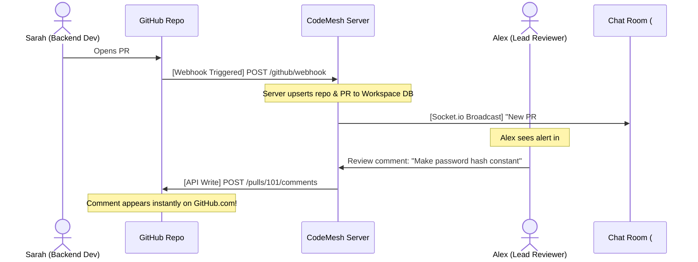
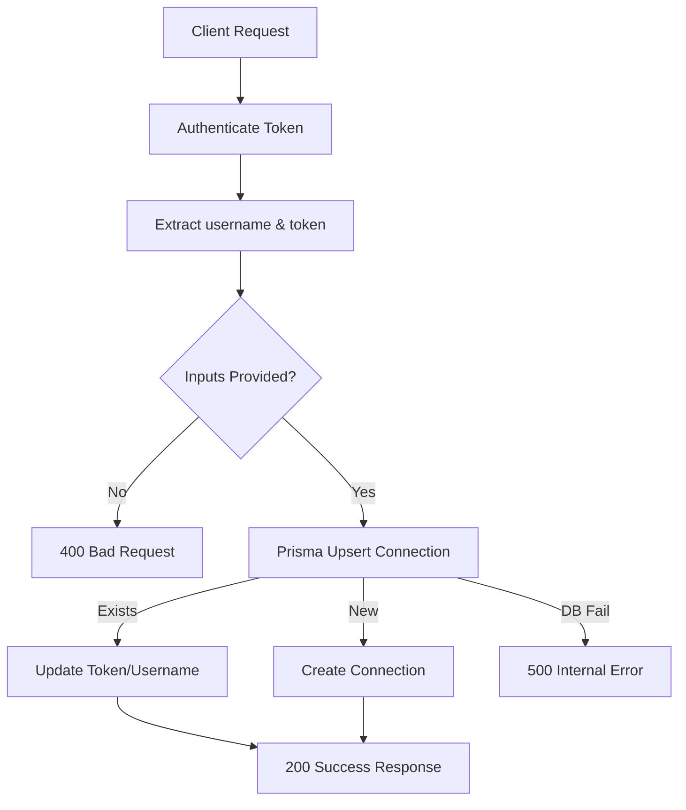
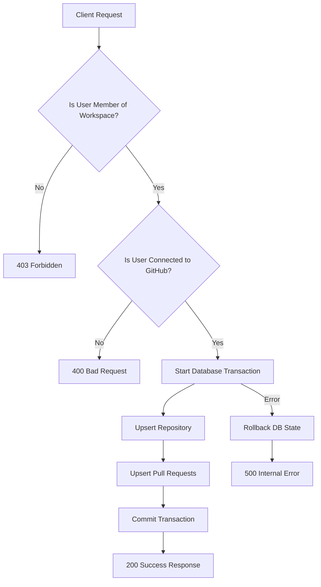

# CodeMesh GitHub Integration Documentation (Phase 9)

This documentation provides a comprehensive walkthrough of what was accomplished today for **Phase 9: GitHub Integration**. It explains the core architectural concepts, details a real-world multi-channel scenario, and breaks down every line of code inside the GitHub route controller with step-by-step explanations, data flows, and sample requests.

---

## Table of Contents
1. [Overview of Accomplishments Today](#1-overview-of-accomplishments-today)
2. [Key Concepts & Architectural Design](#2-key-concepts--architectural-design)
    - [Data Storage (Workspace) vs. Alerts (Channel)](#data-storage-workspace-vs-alerts-channel)
    - [Two-Way Sync Architecture (Webhooks & API Writes)](#two-way-sync-architecture-webhooks--api-writes)
3. [Real-World Team Collaboration Scenario](#3-real-world-team-collaboration-scenario)
4. [Database Models Reference](#4-database-models-reference)
5. [Route-by-Route Code Walkthrough](#5-route-by-route-code-walkthrough)
    - [POST /github/connect](#post-githubconnect)
    - [DELETE /github/disconnect](#delete-githubdisconnect)
    - [POST /github/sync](#post-githubsync)
    - [GET /github/repositories](#get-githubrepositories)

---

## 1. Overview of Accomplishments Today

Today, we successfully extended CodeMesh with the core backend structure for **GitHub Integration**:
1. **Schema Migration**: Modified `schema.prisma` to include relationship fields and 3 new database models (`GitHubConnection`, `Repository`, and `PullRequest`) to map the entities, running the migration successfully on PostgreSQL.
2. **Endpoint Controller**: Created `backend/src/routes/github.js` containing endpoints for connecting/disconnecting accounts, listing synced repositories, and running transactions to sync repositories and mock pull requests.
3. **Service Hookup**: Registered the new router inside `backend/src/index.js` under the `/api/v1/github` endpoint path prefix.

---

## 2. Key Concepts & Architectural Design

### Data Storage (Workspace) vs. Alerts (Channel)
When designing collaborative integrations, it is important to distinguish where data is stored from how the team is notified about it:
* **Workspace-Level Storage**: A software repository (like `api-service`) is a global asset for the entire workspace. It must be accessible by all teams (backend developers, frontend developers, DevOps, and project managers). Saving repositories under the Workspace ensures that any feature (such as dashboards, globally searched snippets, or user profile settings) can locate it.
* **Channel-Level Alerts**: Sending commit or PR alerts to the general channel creates noise and distracts the team. Instead, CodeMesh maps individual repositories to specific channels. Frontend repository logs are routed to a frontend channel, and backend logs are routed to a backend channel. This keeps the workspace uncluttered.

### Two-Way Sync Architecture (Webhooks & API Writes)
The integration operates as a bridge between GitHub and CodeMesh:
1. **GitHub to CodeMesh (Webhooks)**: When a developer pushes code or opens a PR on GitHub.com, GitHub fires a webhook (an HTTP POST alert) to our CodeMesh server. The server updates the database and broadcasts the update to the mapped room in real-time.
2. **CodeMesh to GitHub (API Writes)**: When a reviewer approves a submission or writes a comment inside CodeMesh, our server sends a request to the GitHub API using the reviewer's access token, posting the comment directly onto the GitHub website.

---

## 3. Real-World Team Collaboration Scenario

Here is an example of the workflow in a multi-channel workspace:

* **Workspace**: `Amrita-Devs`
* **Members**: Sarah (Backend), John (Frontend), Alex (Lead Reviewer), and DevOps Bot.
* **Rooms (Channels)**: `#general`, `#backend-reviews`, `#frontend-reviews`, and `#devops-deploy`.



1. **Opening a PR**: Sarah opens a PR on GitHub. GitHub sends a webhook to our server.
2. **Database Sync**: The server saves the repository and PR information to the `Amrita-Devs` workspace storage.
3. **Targeted Alert**: The server looks up the alert configuration: `api-service` is mapped to `#backend-reviews`. It rings the alert bell *only* in the `#backend-reviews` channel.
4. **Independent Work**: Meanwhile, John opens a frontend PR. Its alert goes *only* to `#frontend-reviews`.
5. **Commenting**: Alex reviews Sarah's backend PR inside CodeMesh and writes a feedback comment. The server calls the GitHub API to write Alex's comment onto the GitHub PR page.
6. **Deploy Logs**: Once merged, the build succeeds, and the DevOps Bot posts a success message in `#devops-deploy`.

---

## 4. Database Models Reference

Here are the models defined in the database schema to represent GitHub entities:

```prisma
model GitHubConnection {
  id             String   @id @default(uuid())
  userId         String   @unique @map("user_id")
  githubUsername String   @map("github_username")
  accessToken    String   @map("access_token")
  createdAt      DateTime @default(now()) @map("created_at")
  updatedAt      DateTime @updatedAt @map("updated_at")

  user           User     @relation(fields: [userId], references: [id], onDelete: Cascade)

  @@map("github_connections")
}

model Repository {
  id          String        @id @default(uuid())
  workspaceId String        @map("workspace_id")
  name        String
  fullName    String        @map("full_name")
  githubId    Int           @map("github_id")
  createdAt   DateTime      @default(now()) @map("created_at")
  updatedAt   DateTime      @updatedAt @map("updated_at")

  workspace   Workspace     @relation(fields: [workspaceId], references: [id], onDelete: Cascade)
  pullRequests PullRequest[]

  @@unique([workspaceId, fullName])
  @@map("repositories")
}

model PullRequest {
  id           String     @id @default(uuid())
  repositoryId String     @map("repository_id")
  title        String
  number       Int
  state        String     // OPEN, MERGED, CLOSED
  htmlUrl      String     @map("html_url")
  createdAt    DateTime   @default(now()) @map("created_at")
  updatedAt    DateTime   @updatedAt @map("updated_at")

  repository   Repository @relation(fields: [repositoryId], references: [id], onDelete: Cascade)

  @@unique([repositoryId, number])
  @@map("pull_requests")
}
```

---

## 5. Route-by-Route Code Walkthrough

---

### POST /github/connect
This route connects a user's GitHub credentials to their account by creating or updating their connection entry.



#### 1. Route Definition
```javascript
router.post('/connect', async (req, res) => {
```
Creates a POST API endpoint (`POST /api/v1/github/connect`). The handler is marked `async` because database operations are asynchronous and return promises.

#### 2. Extract Data from Request
```javascript
const { githubUsername, accessToken } = req.body;
const userId = req.user.id;
```
* `req.body` contains the payload sent by the client.
* `req.user.id` is extracted by the `authenticateToken` middleware from the JWT token.

#### 3. Validate Inputs
```javascript
if (!githubUsername || !accessToken) {
    return res.status(400).json({ error: 'githubUsername and accessToken are required' });
}
```
Checks that both parameters are provided. If either is missing, it responds with status code `400 Bad Request` and stops execution.

#### 4. Try-Catch Block & Upsert
```javascript
try {
    const connection = await prisma.gitHubConnection.upsert({
        where: { userId },
        update: { githubUsername, accessToken },
        create: { userId, githubUsername, accessToken }
    });
```
* **Upsert Operation**: Update if it exists, or insert if it doesn't.
* `where`: Finds a connection mapping to the current `userId`.
* `update`: If the row already exists, update its `githubUsername` and `accessToken` (e.g. if the developer updates their token).
* `create`: If no connection exists, insert a new row with the `userId`, `githubUsername`, and `accessToken`.

#### 5. Successful Response
```javascript
    res.status(200).json({
        message: 'GitHub account connected successfully',
        connection: {
            id: connection.id,
            githubUsername: connection.githubUsername,
            createdAt: connection.createdAt
        }
    });
```
Sends status code `200 OK` along with connection details. The sensitive `accessToken` is excluded from the response payload for safety.

#### 6. Error Handling
```javascript
} catch (error) {
    res.status(500).json({ error: error.message });
}
```
Catches database driver failures and returns a `500 Internal Server Error`.

#### Example Request
```http
POST /api/v1/github/connect
Authorization: Bearer <JWT_TOKEN>
Content-Type: application/json

{
  "githubUsername": "octocat",
  "accessToken": "ghp_123456789"
}
```

#### Example Response
```json
{
  "message": "GitHub account connected successfully",
  "connection": {
    "id": "e9b5f3d7-4632-479c-9825-ca73f9ea11e5",
    "githubUsername": "octocat",
    "createdAt": "2026-06-22T12:00:00.000Z"
  }
}
```

---

### DELETE /github/disconnect
Disconnects a user's GitHub account by deleting their connection record.

#### 1. Route Definition
```javascript
router.delete('/disconnect', async (req, res) => {
```
Creates a DELETE endpoint (`DELETE /api/v1/github/disconnect`).

#### 2. Verify Connection Existence
```javascript
    const userId = req.user.id;
    try {
        const existing = await prisma.gitHubConnection.findUnique({
            where: { userId }
        });

        if (!existing) {
            return res.status(404).json({ error: 'No connected GitHub account found' });
        }
```
Checks if a `GitHubConnection` exists for the user. If not, it returns `404 Not Found`.

#### 3. Delete Record & Return Success
```javascript
        await prisma.gitHubConnection.delete({
            where: { userId }
        });

        res.json({ message: 'GitHub account disconnected successfully' });
```
Removes the connection row from the database and returns a success confirmation.

#### Example Request
```http
DELETE /api/v1/github/disconnect
Authorization: Bearer <JWT_TOKEN>
```

#### Example Response
```json
{
  "message": "GitHub account disconnected successfully"
}
```

---

### POST /github/sync
Synchronizes repositories and pull requests for a workspace.



#### 1. Route Definition
```javascript
router.post('/sync', async (req, res) => {
```
Creates a POST endpoint (`POST /api/v1/github/sync`).

#### 2. Workspace Membership Verification
```javascript
    const { workspaceId } = req.body;
    const userId = req.user.id;

    if (!workspaceId) {
        return res.status(400).json({ error: 'workspaceId is required' });
    }

    try {
        const member = await prisma.workspaceMember.findUnique({
            where: { workspaceId_userId: { workspaceId, userId } }
        });

        if (!member) {
            return res.status(403).json({ error: 'Access denied: You are not a member of this workspace' });
        }
```
Ensures the user requesting the synchronization is an active workspace member.

#### 3. GitHub Connection Verification
```javascript
        const connection = await prisma.gitHubConnection.findUnique({
            where: { userId }
        });

        if (!connection) {
            return res.status(400).json({ error: 'Access denied: Please connect your GitHub account first' });
        }
```
Checks if the syncing user has connected their GitHub account.

#### 4. The Transaction & Mock Upserts
```javascript
        const mockRepos = [
            { name: 'api-service', fullName: `${connection.githubUsername}/api-service`, githubId: 10101 },
            { name: 'frontend-app', fullName: `${connection.githubUsername}/frontend-app`, githubId: 10102 }
        ];

        const syncedData = await prisma.$transaction(async (tx) => {
            const result = [];
            for (const repoInfo of mockRepos) {
                // Upsert Repository
                const repo = await tx.repository.upsert({
                    where: {
                        workspaceId_fullName: { workspaceId, fullName: repoInfo.fullName }
                    },
                    update: { name: repoInfo.name, githubId: repoInfo.githubId },
                    create: {
                        workspaceId,
                        name: repoInfo.name,
                        fullName: repoInfo.fullName,
                        githubId: repoInfo.githubId
                    }
                });

                // Sync Pull Requests
                const mockPRs = [
                    { number: 1, title: 'Fix auth token expiry logic', state: 'OPEN', htmlUrl: `https://github.com/${repo.fullName}/pull/1` },
                    { number: 2, title: 'Add Redis caching support', state: 'CLOSED', htmlUrl: `https://github.com/${repo.fullName}/pull/2` }
                ];
```
* **Transaction (`$transaction`)**: Ensures all database modifications succeed together. If any single query fails, the entire transaction is rolled back.
* **Repository Upsert**: Finds repository by composite unique key `workspaceId_fullName`. If it exists, update it; otherwise, create a new record.
* **Pull Request Sync**: Loops through mock pull requests and upserts them relative to the `repositoryId` and PR `number`.

#### Example Request
```http
POST /api/v1/github/sync
Authorization: Bearer <JWT_TOKEN>
Content-Type: application/json

{
  "workspaceId": "03b5360e-984c-4131-a404-1c711aa30560"
}
```

#### Example Response
```json
{
  "message": "Repositories and Pull Requests synchronized successfully",
  "repositories": [
    {
      "id": "bdf234-a1e4",
      "workspaceId": "03b5360e-984c-4131-a404-1c711aa30560",
      "name": "api-service",
      "fullName": "octocat/api-service",
      "githubId": 10101,
      "pullRequests": [
        {
          "id": "pr-hash-11",
          "repositoryId": "bdf234-a1e4",
          "title": "Fix auth token expiry logic",
          "number": 1,
          "state": "OPEN",
          "htmlUrl": "https://github.com/octocat/api-service/pull/1"
        }
      ]
    }
  ]
}
```

---

### GET /github/repositories
Lists all synchronized repositories (with their pull requests) for a workspace.

#### 1. Route Definition & Verification
```javascript
router.get('/repositories', async (req, res) => {
    const { workspaceId } = req.query;
    const userId = req.user.id;
    // ... validates parameters and membership ...
```
Creates a GET endpoint (`GET /api/v1/github/repositories?workspaceId=...`) and checks that the user is authorized.

#### 2. Querying Database
```javascript
        const repositories = await prisma.repository.findMany({
            where: { workspaceId },
            include: { pullRequests: true }
        });

        res.json(repositories);
```
Fetches all repositories matching `workspaceId` and joins their associated `pullRequests` records in the result.

#### Example Request
```http
GET /api/v1/github/repositories?workspaceId=03b5360e-984c-4131-a404-1c711aa30560
Authorization: Bearer <JWT_TOKEN>
```

#### Example Response
```json
[
  {
    "id": "bdf234-a1e4",
    "workspaceId": "03b5360e-984c-4131-a404-1c711aa30560",
    "name": "api-service",
    "fullName": "octocat/api-service",
    "githubId": 10101,
    "pullRequests": [
      {
        "id": "pr-hash-11",
        "number": 1,
        "title": "Fix auth token expiry logic",
        "state": "OPEN"
      }
    ]
  }
]
```

---

## 6. Complete API Execution Flow Example

Below is the complete end-to-end API execution sequence (simulating standard user interactions on the platform).

### Step 1: Register User
A developer registers an account to start using CodeMesh.
* **HTTP Method**: `POST`
* **URL**: `/api/v1/auth/register`
* **Request Body**:
  ```json
  {
    "name": "GitHub Developer",
    "email": "dev_test@example.com",
    "password": "securepassword"
  }
  ```
* **Response Status**: `201 Created`
* **Response Body**:
  ```json
  {
    "message": "User registered successfully",
    "token": "eyJhbGciOiJIUzI1NiIsInR5cCI6IkpXVCJ9...",
    "user": {
      "id": "ebb7ecdc-dd94-4837-80b6-d9e864fb9ec5",
      "name": "GitHub Developer",
      "email": "dev_test@example.com"
    }
  }
  ```
*(Note: Capture the `token` returned above to include in the headers of all subsequent requests).*

---

### Step 2: Create a Workspace
The developer creates a team workspace.
* **HTTP Method**: `POST`
* **URL**: `/api/v1/workspaces`
* **Headers**: `Authorization: Bearer <TOKEN>`
* **Request Body**:
  ```json
  {
    "name": "Amrita Developers Workspace",
    "description": "Engineering team workspace"
  }
  ```
* **Response Status**: `201 Created`
* **Response Body**:
  ```json
  {
    "message": "Workspace created successfully",
    "workspace": {
      "id": "03b5360e-984c-4131-a404-1c711aa30560",
      "name": "Amrita Developers Workspace",
      "description": "Engineering team workspace",
      "ownerId": "ebb7ecdc-dd94-4837-80b6-d9e864fb9ec5",
      "createdAt": "2026-06-22T11:16:33.030Z",
      "updatedAt": "2026-06-22T11:16:33.030Z"
    },
    "defaultChannel": {
      "id": "9d376a82-34e1-46e8-a493-519a876f06a8",
      "workspaceId": "03b5360e-984c-4131-a404-1c711aa30560",
      "name": "general",
      "type": "GENERAL",
      "createdAt": "2026-06-22T11:16:33.049Z"
    }
  }
  ```
*(Note: Capture the workspace `id` returned as `"03b5360e-984c-4131-a404-1c711aa30560"`).*

---

### Step 3: Connect GitHub Account
The developer connects their GitHub profile credentials.
* **HTTP Method**: `POST`
* **URL**: `/api/v1/github/connect`
* **Headers**: `Authorization: Bearer <TOKEN>`
* **Request Body**:
  ```json
  {
    "githubUsername": "octocat",
    "accessToken": "ghp_mock_token_123456"
  }
  ```
* **Response Status**: `200 OK`
* **Response Body**:
  ```json
  {
    "message": "GitHub account connected successfully",
    "connection": {
      "id": "f58d92cb-103f-4228-a6d1-44755a9bca11",
      "githubUsername": "octocat",
      "createdAt": "2026-06-22T11:20:00.000Z"
    }
  }
  ```

---

### Step 4: Sync Workspace Repositories & PRs
The developer syncs repositories and pull requests into the workspace.
* **HTTP Method**: `POST`
* **URL**: `/api/v1/github/sync`
* **Headers**: `Authorization: Bearer <TOKEN>`
* **Request Body**:
  ```json
  {
    "workspaceId": "03b5360e-984c-4131-a404-1c711aa30560"
  }
  ```
* **Response Status**: `200 OK`
* **Response Body**:
  ```json
  {
    "message": "Repositories and Pull Requests synchronized successfully",
    "repositories": [
      {
        "id": "9b1248ca-34ea-46bb-913a-7dbec1199a5e",
        "workspaceId": "03b5360e-984c-4131-a404-1c711aa30560",
        "name": "api-service",
        "fullName": "octocat/api-service",
        "githubId": 10101,
        "createdAt": "2026-06-22T11:25:00.000Z",
        "updatedAt": "2026-06-22T11:25:00.000Z",
        "pullRequests": [
          {
            "id": "c7a82bcf-098d-4eef-ac34-e43598ea1200",
            "repositoryId": "9b1248ca-34ea-46bb-913a-7dbec1199a5e",
            "title": "Fix auth token expiry logic",
            "number": 1,
            "state": "OPEN",
            "htmlUrl": "https://github.com/octocat/api-service/pull/1",
            "createdAt": "2026-06-22T11:25:00.000Z",
            "updatedAt": "2026-06-22T11:25:00.000Z"
          },
          {
            "id": "d0f8d22b-2321-4ea9-bfd4-1a3b98cda334",
            "repositoryId": "9b1248ca-34ea-46bb-913a-7dbec1199a5e",
            "title": "Add Redis caching support",
            "number": 2,
            "state": "CLOSED",
            "htmlUrl": "https://github.com/octocat/api-service/pull/2",
            "createdAt": "2026-06-22T11:25:00.000Z",
            "updatedAt": "2026-06-22T11:25:00.000Z"
          }
        ]
      },
      {
        "id": "0d2cbf76-353d-4c3e-8ea1-ca913fb9a3d4",
        "workspaceId": "03b5360e-984c-4131-a404-1c711aa30560",
        "name": "frontend-app",
        "fullName": "octocat/frontend-app",
        "githubId": 10102,
        "createdAt": "2026-06-22T11:25:00.000Z",
        "updatedAt": "2026-06-22T11:25:00.000Z",
        "pullRequests": [
          {
            "id": "e9a0d24f-a2e1-4cbe-ba43-98feab9c123d",
            "repositoryId": "0d2cbf76-353d-4c3e-8ea1-ca913fb9a3d4",
            "title": "Fix auth token expiry logic",
            "number": 1,
            "state": "OPEN",
            "htmlUrl": "https://github.com/octocat/frontend-app/pull/1",
            "createdAt": "2026-06-22T11:25:00.000Z",
            "updatedAt": "2026-06-22T11:25:00.000Z"
          },
          {
            "id": "f8a7d2e3-0b1a-4c2d-9e3f-a21b47c6a992",
            "repositoryId": "0d2cbf76-353d-4c3e-8ea1-ca913fb9a3d4",
            "title": "Add Redis caching support",
            "number": 2,
            "state": "CLOSED",
            "htmlUrl": "https://github.com/octocat/frontend-app/pull/2",
            "createdAt": "2026-06-22T11:25:00.000Z",
            "updatedAt": "2026-06-22T11:25:00.000Z"
          }
        ]
      }
    ]
  }
  ```

---

### Step 5: List Synced Repositories
Another developer in the workspace fetches the list of repositories to review the PR states.
* **HTTP Method**: `GET`
* **URL**: `/api/v1/github/repositories?workspaceId=03b5360e-984c-4131-a404-1c711aa30560`
* **Headers**: `Authorization: Bearer <TOKEN>`
* **Response Status**: `200 OK`
* **Response Body**: An array containing the same synced `Repository` and nested `PullRequest` objects as seen in Step 4.

---

### Step 6: Disconnect GitHub Account
The developer decides to disconnect their GitHub account.
* **HTTP Method**: `DELETE`
* **URL**: `/api/v1/github/disconnect`
* **Headers**: `Authorization: Bearer <TOKEN>`
* **Response Status**: `200 OK`
* **Response Body**:
  ```json
  {
    "message": "GitHub account disconnected successfully"
  }
  ```

```
